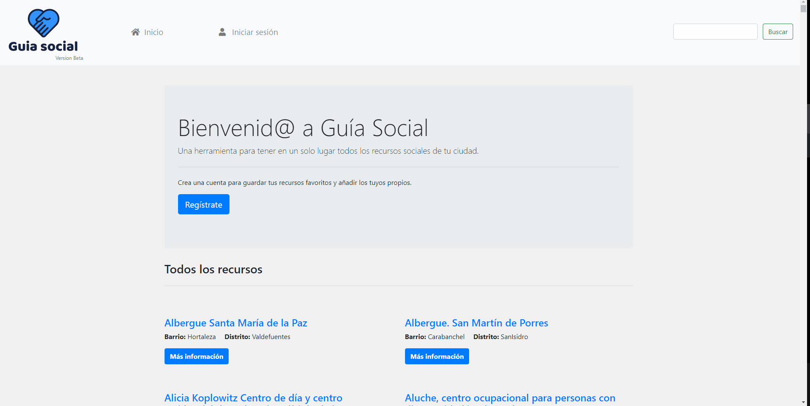

# Guía Social



"Guía Social" nace con la ilusión de convertirse en un recurso habitual de las profesionales de entidades y organizaciones del Tercer Sector (flaskjadoras/es Sociales, Educadoras/es, Técnicos de Integración Social, etc.).
bootstrapActualmente la aplicación está centada en el municipio de Madrid, pero la intención es seguir ampliando la base de datos.

### Tecnologías empleadas
   

## Instalación:
1. Para ejecutar el proyecto es necesiario instalar ``pip`` y ``virtualenv`` para crear un entorno virtual y activarlo:
```
#Instalación de pip
sudo apt-get install python3-pip

#Instalación de virtualenv
sudo pip3 install virtualenv

#Crear entorno virtual
virtualenv nombre_de_tu_entorno -p python3

#Activar entorno vitual
source nombre_entorno_virtual/bin/activate
```
2. Instala con pip las dependencias que encontrarás el archivo "requirements.txt" con ``pip install -r requirements.txt``
3. Completa el archivo ".env-example" con tus API Keys y renombralo para que quede como ".env"
4. Ejecuta con el comando ``flask run`` para arrancar el archivo ```app.py``` (Al arrancar el servidor de flask por primera vez dale unos segundos, tiene que generar la base de datos SQLite a partir de los datos de la API)
5. ¡Listo! ¡A trastear con el proyecto! :)


## ToDo List:
1. Ampliar base de datos: Incluir información de otras apis de https://datos.madrid.es
2. Implementar crawler que extraiga datos de contacto de la web de https://madrid.es
3. Añadir funcionalidad que permita actualizar la base de datos.
4. Permitir a los usuarios/as hacer comentarios y valoraciones sobre las entidades.

